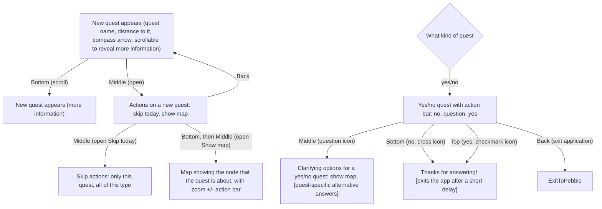

These flows are prompted by user location rather than explicit actions:

    - `NewQuest` appears when there is a quest nearby and makes it active
    - `QuestOfSomeKind` appears when you arrive at the location of the currently active quest

